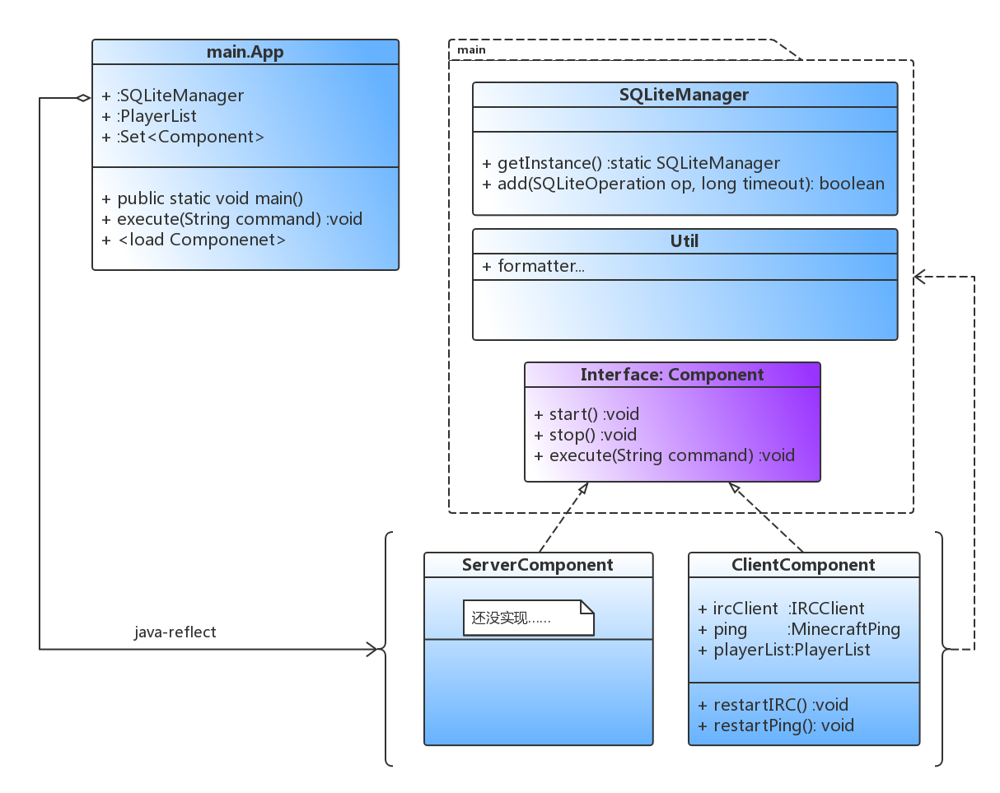

# KedamaOnlineRecorder
A Recorder to record the changes of player number in 'The Minecraft Server', with database;inherit prj "kedamaListener" at https://github.com/DWCarrot/kedamaListener

## 2018/7/14
- 各个组件编写完成；
- 总体框架确定：仅实现数据获取部分，数据通过sqlite（包括IN-MEMORY模式）交互
- 1.13正式版7月18号就要发布了……要来不及了= =

## 2018/7/18
- 取消使用IN-MEMORY模式，改变表结构
- 完成大部分功能；TODO：日志
- 拟尝试用统一的Timer实现调度

## 2018/7/19
- 不完全使用ping来修正信息；考虑到返回玩家列表不全……（真的是”sample“啊= =）
- 使用java.util.ScheduleService管理各个部分线程
- 第一个可以运行的版本
- TODO：irc响应--手动修正

## 2018/7/21
- 再次修正ping修正的算法（证明了一个早上= =）
- 上线测试进行中
- TODO：模块化

## 2018/7/23
- 修复一些小bug
- 模块化初步完成
  
- 修改database储存方式：运行表('online_count','online_record') ==[定时分离插入]==> 记录表 ('online_count_static','online_record_static')